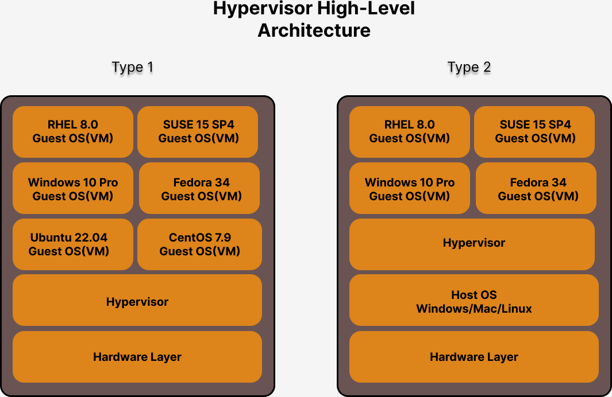

# Day1

## What is dual/multi booting with boot loader utilities?
- boot loader is a system utility that is installed in Master Boot Record(MBR) in your hard disk
- Master Boot Loader is typically 512 bytes, hence the boot utility size will have fit within the 512 bytes
- Examples
  - LILO
  - GRUB 1
  - GRUB 2
- when a system is booted, the BIOS(Basic Input Output System) - POST(Power On Self Test) once completed, the BIOS will instruct the CPU to run the boot loader utility
- the boot loader utility then scans your hard disk looking for OS, if there are multiple OS installed on your system, then it gives a menu for you to choose the OS you wish to boot into
- though many OS can be installed only one OS can be active at point of time

## What is Hypervisor?
- is virtualization technology
- supports running many Operating System on the same laptop/desktop/workstation/server
- many OS can be active at the same time
- hardware/software technology
- Processors
  - AMD (Advanced Micro Devices) - General Purpose Processors - Virtualization Feature is called AMD-V
  - Intel - General Purpose Processors - Virtualization Feature - VT-X
  - Apple Silicon(ARM Processor) - Embedded
- there are 2 types
  - Type 1
    - Bare-metal hypervisor
    - no OS is required to installed this type of Hypervisor
    - meant for Servers
  - Type 2
    -  For laptops/desktops/workstations
    -  requires Host OS ( could be any of these OS - Unix, Linux, Mac or Windows )
- this type of virtualization is called heavy-weight virtualization
  - because each Virtual machine has to be allocated with dedicated hardware resources
    - CPU Cores
    - RAM
    - Storage - Hard disk
    - Graphics Card
    - Network Card
- each Virtual machine represents one fully functional Operating System
- Examples
  - VMWare
    - Fusion ( Mac OS-X )
    - Workstation ( Linux & Windows )
    - vSphere/vCenter - Bare-metal Hypervisors
  - Oracle VirtualBox - Free works in Linux/Mac/Windows
  - Parallels ( Mac OS-X )
  - Microsoft Hyper-V

## What is Container Technology?
- is an application virtualization technolgy
- each container represents one application process
- though it may look and behave like OS in some cases, technically it is an application
- it doesn't have OS Kernel
- one container represents one application
- many containers can run within an OS
- this type of virtualization is consider lightweight virtualization as they don't require dedicated hardware resources
- containers running in the same OS shares the hardware resources in that OS just like how other normal applications share hardware resources
- containers depend on Linux Kernel Features
  1. Namespace
     - helps in isolating one container from other containers
  2. Control Groups (CGroups)
     - used to apply resource quota restrictions
      - we can limit how cpu cores at the max a container can utilize
      - we can limit how much RAM at the max one container can utilize
 
## What is a Container Engine?
- a high-level user-friendly software that manages container/images
- it depends on Container Runtime to manage containers
- Examples
  - Docker
  - Podman
- Docker Container Engine depends on runC Container Runtime
- Podman Container Engine depends on CRI-O Container Rutnime

## What is Container Runtime?
- a software that manages containers
  - creating a container
  - listing a container
  - stop/start/restarting/kill/abort/delete container
- depends on OS Kernel to create/manage containers
- they are low-level software which isn't user-friendly
- hence normally no end-users directly use the container runtime
- Examples
  - runC 
  - CRI-O
  
## What is Docker?
- a high-level software that depends on Linux Kernel to support application virtualization
- a Container Engine
- it is user-friendly tool to manage docker images/containers
- is developed in Go programming languaged by the company Docker Inc
- comes in 2 flavours
  1. Docker Community Edition - Docker CE ( Free )
  2. Docker Enterprise Edition - Docker EE ( Paid )
- follows client/server architecture
  client tool
  - docker
  server tool
  - runs as a service called dockerd in linux
- the end-users need not have to know low-level kernel stuffs to work in containers
- Docker depends on containerd which depends on Container Runtime called runC

## Hypervisor High-Level Architecture


## Docker High-Level Architecture


## What is Docker Local Registry?
- is a directory in your local machine
- in Linux machines /var/lib/docker is the directory that acts as a Local Docker Registry
- Docker Registries has a collection of many Docker Images

## What is Docker Private Registry?
- Docker Private Registry has collection of many Proprietary Docker Images and other third party open source and paid images
- this can be setup using either JFrog Artifcatory or Sonatype Nexus
- for testing/learning purpose you could also try registry:2 docker image from Docker Hub Remote Registry
- this is setup for your entire organization, so that images can be shared by all the teams with your company

## What is Docker Remote Registry?
- aka Remote Docker Registry
- it is a Website maintained by Docker Inc organization
- it has many open-source and third-party docker images
- the images can be freely downloaded and used by anyone
- Website url - hub.docker.com

## What is Docker Image?
- it is similar to Windows ISO Operating System image we burn in DVDs
- using the Windows 11 Installer DVD/ISO Image, we can install Windows 11 in many laptops/desktops/workstation/servers
- similar to that, Docker Image is required to create containers
- Example
  - Using mysql docker image, we can create 1-to-many mysql docker containers
  - Using nginx docker image, we can create many nginx docker containers
- in other words, it is a specification of Docker container

## What is Docker Container?
- running instance of a Docker Image
- each container represents one application
- container is not OS
- container has its own file sytem
- container has its own port range ( 0 - 65535 )
- container has its own network stack ( 7 OSI Layers )
- container has its own virtual network card
- container has its own Private IP address
- it has one application binary with all its dependent libraries pre-installed
- it comes with basic minimum tools

## What type of applications can be containerized?
- Web Server
- Application Server
- DB servers
- REST API
- SOAP API
- Message Queue Servers
- Microservices, etc.,

# Docker Commands

## Demo - Installing Docker CE in CentOS 7.9


## Lab - Checking your docker version on the CentOS Lab machine
```
docker --version
```

Expected output
<pre>
┌──(jegan㉿tektutor.org)-[~/openshift-sep-2023]
└─$ docker --version
Docker version 20.10.25+dfsg1, build b82b9f3
</pre>

## Lab - Listing docker images in your local docker registry
```20.10.25+dfsg1, build b82b9f3

docker images
```

Expected output


## Lab - Docker Remote Registry
Navigate to the below URL in your CentOS web browser
<pre>
http://hub.docker.com 
</pre>

Expected output


Click on Explore link in the hub.docker.com website, you will get below page


## Lab - Download docker image from Docker Hub Remote Registry to Docker Local registry
```
docker pull mysql:latest
docker images
```

Expected output


## Lab - Deleting docker image from your local docker registry
```
docker images
docker rmi hello-world:latest
docker images
```

Expected output


## Lab - Creating your first container
Listing and check if hello-world:latest docker image is present in your local docker registry
```
docker images
```
Expected output
<pre>
┌──(jegan㉿tektutor.org)-[~/openshift-sep-2023]
└─$ docker images                
REPOSITORY                     TAG        IMAGE ID       CREATED         SIZE
tektutor/ansible-centos-node   latest     758c48f5a98f   5 days ago      428MB
tektutor/ansible-ubuntu-node   latest     7e779b4b95bb   6 days ago      220MB
nginx                          latest     eea7b3dcba7e   3 weeks ago     187MB
ubuntu                         22.04      c6b84b685f35   3 weeks ago     77.8MB
mysql                          latest     99afc808f15b   4 weeks ago     577MB
centos                         7.9.2009   eeb6ee3f44bd   24 months ago   204MB
ubuntu                         16.04      b6f507652425   2 years ago     135MB
</pre>


You can now create a container
```
docker run hello-world:latest
```

Expected output
<pre>
┌──(jegan㉿tektutor.org)-[~/openshift-sep-2023]
└─$ docker run hello-world:latest                                                                            
Unable to find image 'hello-world:latest' locally
latest: Pulling from library/hello-world
719385e32844: Pull complete 
Digest: sha256:dcba6daec718f547568c562956fa47e1b03673dd010fe6ee58ca806767031d1c
Status: Downloaded newer image for hello-world:latest

Hello from Docker!
This message shows that your installation appears to be working correctly.

To generate this message, Docker took the following steps:
 1. The Docker client contacted the Docker daemon.
 2. The Docker daemon pulled the "hello-world" image from the Docker Hub.
    (amd64)
 3. The Docker daemon created a new container from that image which runs the
    executable that produces the output you are currently reading.
 4. The Docker daemon streamed that output to the Docker client, which sent it
    to your terminal.

To try something more ambitious, you can run an Ubuntu container with:
 $ docker run -it ubuntu bash

Share images, automate workflows, and more with a free Docker ID:
 https://hub.docker.com/

For more examples and ideas, visit:
 https://docs.docker.com/get-started/  
</pre>

You can now check the above command first downloaded hello-world:latest image into your local registry
```
docker images
```
Expected output
<pre>
┌──(jegan㉿tektutor.org)-[~/openshift-sep-2023]
└─$ docker images                
REPOSITORY                     TAG        IMAGE ID       CREATED         SIZE
tektutor/ansible-centos-node   latest     758c48f5a98f   5 days ago      428MB
tektutor/ansible-ubuntu-node   latest     7e779b4b95bb   6 days ago      220MB
nginx                          latest     eea7b3dcba7e   3 weeks ago     187MB
ubuntu                         22.04      c6b84b685f35   3 weeks ago     77.8MB
mysql                          latest     99afc808f15b   4 weeks ago     577MB
<b>hello-world                    latest     9c7a54a9a43c   4 months ago    13.3kB</b>
centos                         7.9.2009   eeb6ee3f44bd   24 months ago   204MB
ubuntu                         16.04      b6f507652425   2 years ago     135MB  
</pre>

You can see the running containers with the below command
```
docker ps
```

If you wish to see all containers even if they aren't running
```
docker ps -a
```

Expected output


## Lab - Renaming an existing container 
```
docker rename <old-name> <new-name>
docker rename vigorous_panini hello1_container
```

Expected output


## Lab - Creating a container with specific name and hostname
```
docker run --name jegan-hello-container --hostname jegan-hello-container hello-world:latest 
```

Expected output


## Lab - Deleting exited containers
```
docker ps -a
docker rm hello1_container jegan-hello-container
docker ps -a
```

Expected output


## Lab - Creating containers and run them in the background
```
docker run -dit --name ubuntu1 --hostname ubuntu1 ubuntu:22.04 /bin/bash
docker run -dit --name ubuntu2 --hostname ubuntu2 ubuntu:22.04 /bin/bash
docker ps
```

In the above command,
<pre>
dit - means deattached interactive terminal i.e run the container in the background
name - name of the container
hostname - any user-defined hostname you wish to assign to your container
ubuntu:22.04 - is the docker image using which the container will be created
/bin/bash - indicates we would to run/launch bash terminal inside the container as default application
host  
</pre>

Expected output


## Lab - Getting inside container that is running in background
```
docker ps
docker exec -it ubuntu1 /bin/bash
hostname
hostname -i
ls
exit
```

Expected output


## Lab - Creating a container in interactive mode
```
docker run -it --name ubuntu3 --hostname ubuntu3 ubuntu:22.04 /bin/bash
exit
```

Exiting from the shell will lead to exitting the container, as /bin/bash is the default application running inside container.

Expected output


## Lab - Starting an exited container
```
docker ps
docker ps -a
docker start ubuntu3
docker ps
```

Expected output


## Lab - Starting multiple containers
```
docker ps
docker ps -a
docker start ubuntu1 ubuntu2 ubuntu3
```

Expected output


## Lab - Stopping running containers
```
docker ps
docker stop ubuntu1
docker ps
docker stop ubuntu2 ubuntu3
docker ps -a
```

Expected output


## Lab - Stopping and Starting multiple containers without calling out their names
```
docker ps
docker ps -q
docker stop $(docker ps -q)
docker ps
docker ps -a
docker ps -aq
docker start $(docker ps -aq)
docker ps
```

Expected output


## Lab - Deleting multiple containers gracefully without calling out their names
```
docker ps
docker rm $(docker ps -q)
docker stop $(docker ps -q) && docker rm $(docker ps -aq)
docker ps -a
```

Expected output


## Lab - Deleting multiple containers forcibly without calling out their names
```
docker run -dit --name ubuntu1 --hostname ubuntu1 ubuntu:22.04 /bin/bash
docker run -dit --name ubuntu2 --hostname ubuntu2 ubuntu:22.04 /bin/bash
docker run -dit --name ubuntu3 --hostname ubuntu3 ubuntu:22.04 /bin/bash
docker ps
docker rm -f $(docker ps -aq)
docker ps -a
```

Expected output


## Lab - Finding IP address of a running container
```
docker ps
docker inspect ubuntu1 | grep IPA
docker inspect -f {{.NetworkSettings.IPAddress}} ubuntu2
docker inspect -f {{.NetworkSettings.IPAddress}} ubuntu3
```

Expected output


## Lab - Creating 3 centos containers
```
docker ps
docker run -dit --name centos1 --hostname centos1 centos:centos7.9.2009 /bin/bash
docker run -dit --name centos2 --hostname centos2 centos:centos7.9.2009 /bin/bash
docker run -dit --name centos3 --hostname centos3 centos:centos7.9.2009 /bin/bash
docker ps
```

Expected output


## Lab - List containers name that matches a name pattern
```
docker ps -f "name=ubuntu"
docker ps -f "name=centos"
docker ps -f "name=c"
```

Expected output


## Lab - Listing all containers whose image name matches a given value
```
docker ps | grep centos:centos7.9.2009
docker ps | grep ubuntu:22.04
```

Expected output


## Lab - Creating a mysql db server container
When prompts for password, type "root@123" without the double quotes.
```
docker ps -a
docker run -d --name mysql --hostname mysql -e MYSQL_ROOT_PASSWORD=root@123 mysql:latest
docker ps
docker exec -it mysql sh
mysql -u root -p
```

Expected output


Checking default databases in mysql server and creating a new database named tektutor
```
SHOW DATABASES;
CREATE DATABASE tektutor;
SHOW DATABASES;
USE tektutor
```

Expected output


Creating table inside tektutor database and inserting some records into training table.
```
CREATE TABLE training ( id INT NOT NULL, name VARCHAR(250), duration VARCHAR(250), PRIMARY KEY(id) );
SHOW TABLES;
INSERT INTO training VALUES ( 1, "DevOps", "5 Days" );
INSERT INTO training VALUES ( 2, "Advanced OpenShift", "5 Days" );
INSERT INTO training VALUES ( 3, "Advanced Ansible", "5 Days" );
SELECT * FROM training;
exit
```

Expected output


## Lab - Checking mysql db server logs
```
docker ps
docker logs mysql
```

Expected output

